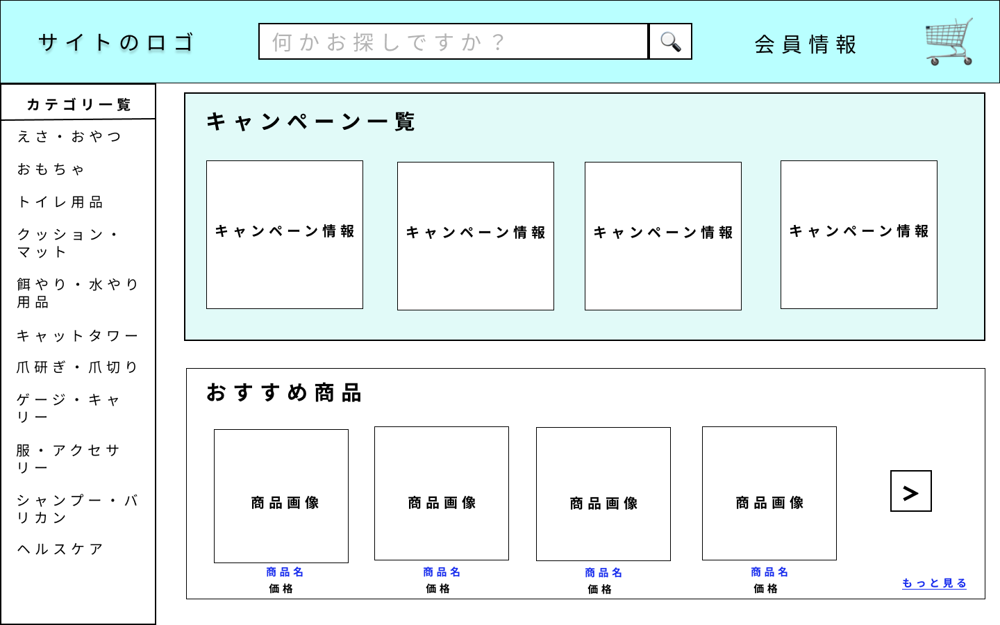

### 画面詳細図
## ログイン後トップページ
### プロトタイプは以下のリンク先
[プロトタイプ](https://www.figma.com/file/YYWh5kbu1skb3vIKigipCm/Untitled?node-id=7%3A0)
******

*****
補足：対応DBの列はDB設計後、○を対応するテーブル・カラム名に差し替えること

| ID | 要素 | 内容 | アクション | イベント | 対応DB |
|----|-----|-----|---------|--------|-------|
|1|ロゴ|サイト名表示|-|-|-|
|2|検索欄|入力欄|テキスト入力|-|-|
|3|検索ボタン|ボタン|クリック|商品一覧へ移動|○|
|4|会員情報|テキスト表示|-|-|-|
|5|カート|ボタン|-|-|-|
|6|カテゴリ一覧|テキスト表示|-|-|-|
|7|えさ・おやつ|テキスト表示|-|-|-|
|8|おもちゃ|テキスト表示|-|-|-|
|9|トイレ用品|テキスト表示|-|-|-|
|10|クッション・マット|テキスト表示|-|-|-|
|11|餌やり・水やり用品|テキスト表示|-|-|-|
|12|キャットタワー|テキスト表示|-|-|-|
|13|爪研ぎ・爪切り|テキスト表示|-|-|-|
|14|ゲージ・キャリー|テキスト表示|-|-|-|
|15|服・アクセサリー|テキスト表示|-|-|-|
|16|シャンプー・バリカン|テキスト表示|-|-|-|
|17|ヘルスケア|テキスト表示|-|-|-|
|18|キャンペーン情報|テキスト表示|-|-|-|
|19|キャンペーン画像|画像表示|-|-|-|
|20|おすすめ商品|テキスト表示|-|-|-|
|21|商品画像|画像リンク|-|-|○|
|22|商品名|テキストリンク|-|-|○|
|23|価格|テキスト表示|-|-|○|
|2４|右矢印ボタン|ボタン|-|-|-|
|2５|もっと見る|テキスト表示|-|-|-|
|2６|会員情報|テキスト表示|クリック|会員情報へ移動|○|
|27|注文履歴|テキスト表示|クリック|注文履歴へ移動|○|
|28|カート内|テキスト表示|クリック|カート内へ移動|○|
|29|定期便情報|テキスト表示|クリック|定期便情報へ移動|○|
|30|ペット情報|テキスト表示|クリック|ペット情報へ移動|○|
|31|ヘルプ|テキスト表示|クリック|ヘルプへ移動|-|
|2６|ログアウト|テキスト表示|クリック|ログアウト処理|-|

