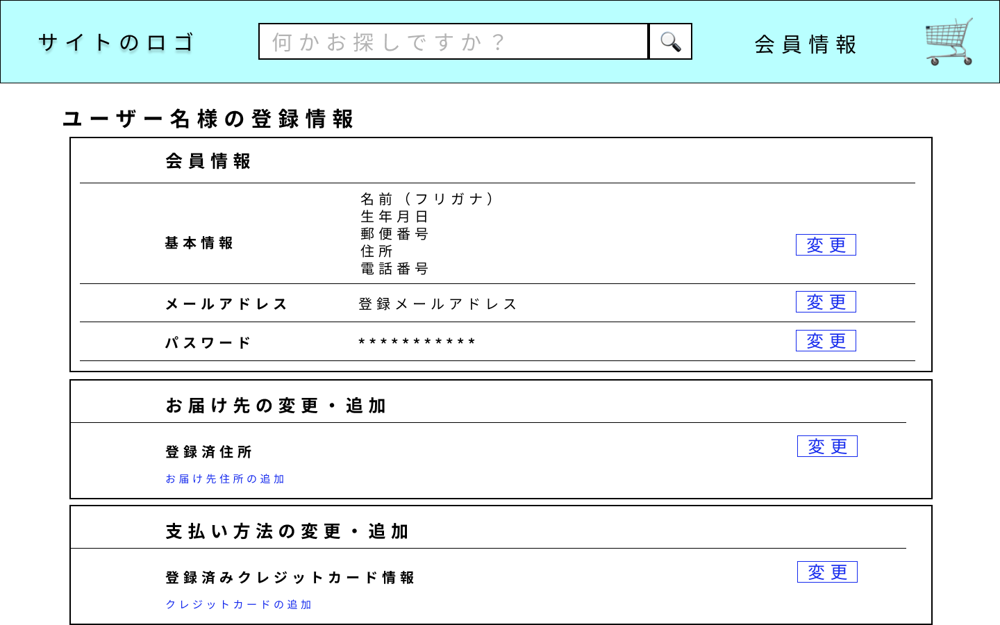

### 画面詳細図
## 会員情報画面
### プロトタイプは以下のリンク先
[プロトタイプ](https://www.figma.com/file/YYWh5kbu1skb3vIKigipCm/Untitled?node-id=7%3A71)
******

*****
補足：対応DBの列はDB設計後、○を対応するテーブル・カラム名に差し替えること

| ID | 要素 | 内容 | アクション | イベント | 対応DB |
|----|-----|-----|---------|--------|-------|
|1|ロゴ|サイト名表示|クリック|ログイン後トップへ移動|-|
|2|検索欄|入力欄|テキスト入力|-|-|
|3|検索ボタン|ボタン|クリック|商品一覧へ移動|○|
|4|会員情報|テキスト表示|カーソルを合わせる|アカウントサービスへ移動|-|
|5|ユーザー名様の登録情報|テキスト表示|-|-|-|
|6|基本情報|テキスト表示|-|-|-|
|7|名前|テキスト表示|-|-|○|
|8|生年月日|テキスト表示|-|-|○|
|9|郵便番号|テキスト表示|-|-|○|
|10|住所|テキスト表示|-|-|○|
|１１|電話番号|テキスト表示|-|-|○|
|12|基本情報|テキスト表示|-|-|○|
|13|変更|ボタン|クリック|会員情報変更画面へ移動|-|
|14|お届け先の変更追加|テキスト表示|-|-|-|
|1５|住所|テキスト表示|-|-|○|
|16|変更|ボタン|クリック|登録住所変更画面へ移動|-|
|17|お届け先の追加|テキスト表示|クリック|登録住所の追加へ移動|-|
|18|お支払い方法の変更追加|テキスト表示|-|-|-|
|19|クレジットカード情報|テキスト表示|-|-|○|
|20|変更|ボタン|クリック|クレジットカード情報変更画面へ移動|-|
|21|クレジットカードの追加|テキスト表示|クリック|登録住所の追加へ移動|-|

