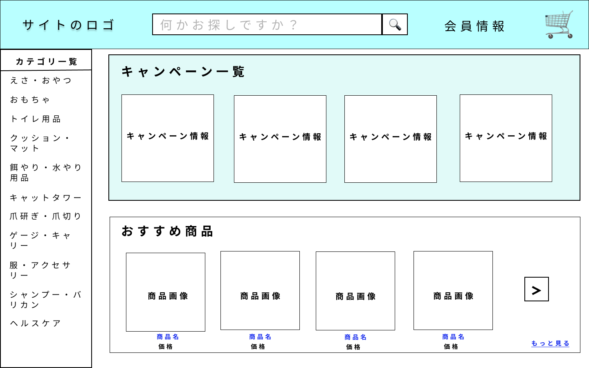

### 画面詳細図
## 商品詳細画面１
### プロトタイプは以下のリンク先
[プロトタイプ](https://www.figma.com/file/YYWh5kbu1skb3vIKigipCm/Untitled?node-id=0%3A1)
******

*****
補足：対応DBの列はDB設計後、○を対応するテーブル・カラム名に差し替えること

| ID | 要素 | 内容 | アクション | イベント | 対応DB |
|----|-----|-----|---------|--------|-------|
|1|ロゴ|サイト名表示|-|-|-|
|2|検索欄|入力欄|テキスト入力|-|-|
|3|検索ボタン|ボタン|クリック|商品一覧へ移動|○|
|4|会員情報|テキスト表示|カーソルを合わせる|アカウントサービスへ移動|-|
|5|カート|ボタン|クリック|カートへ移動|○|
|6|ブランド|テキスト表示|クリック|商品一覧画面へ移動|○|
|７|商品名|テキスト表示|-|-|○|
|8|価格|テキスト表示|-|-|○|
|9|商品説明|テキスト表示|-|-|○|
|10|カスタマーレビュー|テキスト表示|-|-|-|
|11|全体評価|テキスト画像表示|-|-|○|
|12|ユーザー画像|画像表示|-|-|○|
|13|ユーザー名|テキスト表示|-|-|○|
|14|ユーザ評価|テキスト表示|-|-|-|
|15|カスタマーレビューを書く|テキスト表示|クリック|レビュー作成へ移動|-|
|16|全てのレビューを見る|テキスト表示|クリック|レビューへ移動|-|
|17|選択|チェックリスト|選択|-|-|
|18|お届け予定日|テキスト表示|-|-|-|
|19|日時|テキスト表示|-|-|○|
|20|在庫情報|テキスト表示|-|-|○|
|21|数量|テキスト表示|-|-|-|
|22|数量選択|入力欄|入力|-|-|
|23|カートに入れる|ボタン|クリック|カートに追加処理|○|
|24|関連商品|テキスト表示|-|-|-|
|25|関連商品画像|画像表示|クリック|商品詳細へ移動|○|

