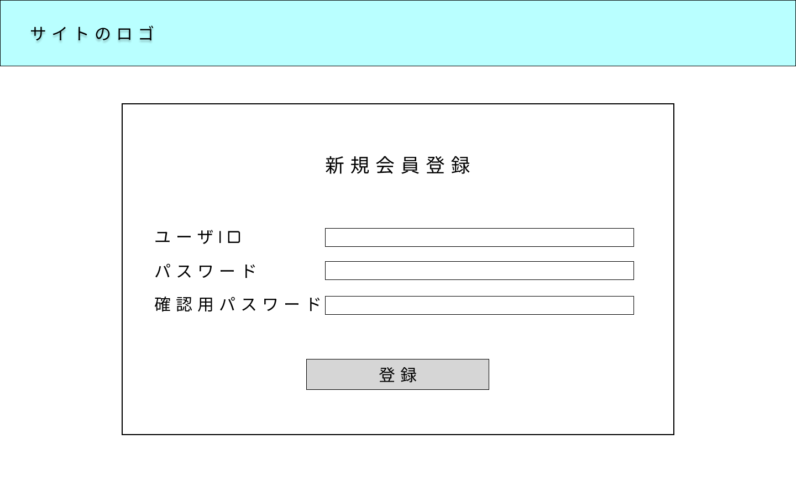

### 画面詳細図
## 新規会員登録画面
### プロトタイプは以下のリンク先
[プロトタイプ](https://www.figma.com/file/YYWh5kbu1skb3vIKigipCm/Untitled?node-id=5%3A112)
******

*****
補足：対応DBの列はDB設計後、○を対応するテーブル・カラム名に差し替えること

| ID | 要素 | 内容 | アクション | イベント | 対応DB |
|----|-----|-----|---------|--------|-------|
|1|ロゴ|サイト名表示|-|-|-|
|2|新規会員登録|テキスト表示|テキスト入力|-|-|
|3|ユーザー名|テキスト表示|-|-|-|
|4|ユーザー名入力欄|入力欄|テキスト入力|-|-|
|5|パスワード|テキスト表示|-|-|-|
|6|パスワード入力欄|入力欄|テキスト入力|-|-|
|８|確認用パスワード|テキスト表示|-|-|-|
|9|確認用パスワード入力欄|入力欄|テキスト入力|-|-|
|10|登録|ボタン|クリック|会員登録処理|○|

